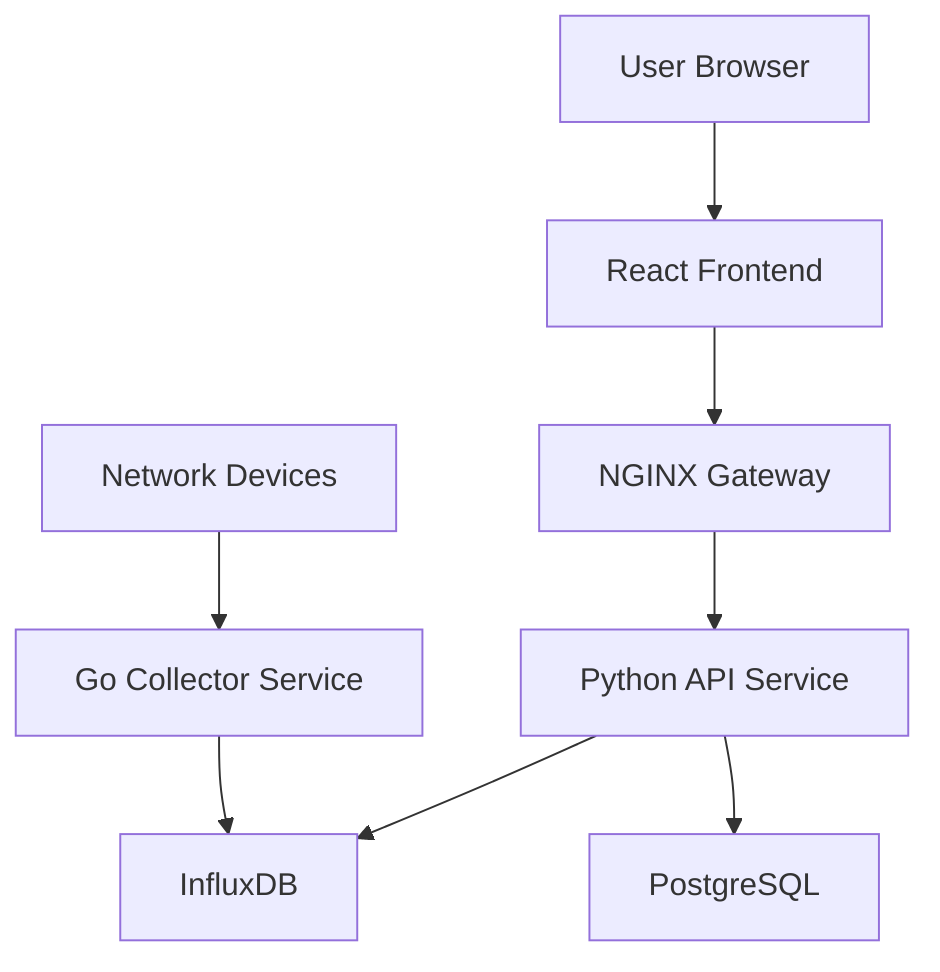

# 🌐 Network Monitoring App

<div align="center">

[](https://opensource.org/licenses/MIT)
[](https://www.docker.com/)
[](https://reactjs.org/)
[](https://fastapi.tiangolo.com/)
[](https://golang.org/)

*A comprehensive network monitoring solution for modern infrastructure*

</div>

## 📋 Overview

The Network Monitoring App is a full-stack solution designed to provide comprehensive visibility into network infrastructure. Built with a modern microservices architecture, it offers automated device discovery, real-time monitoring, proactive alerting, and visual network mapping.

### 🎯 Key Features

- **🔍 Automated Network Discovery** - Scan and identify all network devices (PCs, routers, switches)
- **📊 Real-time Monitoring** - Track CPU, memory, temperature, and network metrics
- **🚨 Proactive Alerting** - Customizable alerts with multiple notification channels (Email, Discord, Line)
- **🗺️ Visual Network Mapping** - Interactive topology visualization
- **📦 Asset Inventory** - Comprehensive device management and tracking
- **🔐 Role-based Access Control** - Administrator and Viewer roles with JWT authentication
- **📱 Responsive Design** - Works seamlessly across desktop, tablet, and mobile devices

## 🏗️ Architecture

### High-Level Overview

The system follows a **microservices architecture** within a **monorepo structure**, optimized for scalability and maintainability:



### 🛠️ Technology Stack

| Component | Technology | Version | Purpose |
|-----------|------------|---------|----------|
| **Frontend** | React + TypeScript | 18.2.0 / 5.0.4 | Modern UI with type safety |
| | Tailwind CSS | 3.3.3 | Utility-first styling |
| | Zustand | 4.4.1 | Lightweight state management |
| **Backend API** | Python + FastAPI | 3.11 / 0.103.1 | High-performance REST API |
| **Data Collector** | Go | 1.21 | Efficient metric collection |
| **Databases** | InfluxDB Cloud | 2.0 | Time-series metrics storage |
| | PostgreSQL | 15 | Relational data (via Supabase) |
| **Infrastructure** | Docker + NGINX | Latest / 1.25 | Containerization & API Gateway |
| **Testing** | Jest + Pytest | 29.7.0 / 7.4.2 | Comprehensive test coverage |

## 🚀 Quick Start

### Prerequisites

- Docker & Docker Compose
- Node.js 22.14.0+ (for development)
- Git

### Installation

1. **Clone the repository**
   ```bash
   git clone <repository-url>
   cd network-monitoring-app
   ```

2. **Configure environment**
   ```bash
   cp env.example .env
   # Edit .env with your configuration values
   ```

3. **Start the application**
   ```bash
   docker-compose up
   ```

4. **Access the application**
   - **Frontend**: http://localhost:3000
   - **API Gateway**: http://localhost:8080
   - **API Documentation**: http://localhost:8000/docs

## 📁 Project Structure

```
network-monitoring-app/
├── 📁 .github/workflows/     # CI/CD pipelines
├── 📁 apps/
│   ├── 📁 frontend/          # React TypeScript application
│   │   ├── 📁 src/
│   │   │   ├── 📁 components/
│   │   │   ├── 📁 pages/
│   │   │   ├── 📁 services/
│   │   │   └── 📁 utils/
│   │   └── 📄 package.json
│   ├── 📁 api-python/        # FastAPI backend service
│   │   ├── 📁 app/
│   │   │   ├── 📁 models/
│   │   │   ├── 📁 routes/
│   │   │   └── 📁 services/
│   │   └── 📄 requirements.txt
│   └── 📁 collector-go/      # Go data collection service
│       ├── 📁 cmd/
│       ├── 📁 internal/
│       └── 📄 go.mod
├── 📁 packages/
│   └── 📁 shared-types/      # TypeScript type definitions
├── 📁 docs/                  # Documentation
│   ├── 📁 architecture/
│   ├── 📁 prd/
│   └── 📁 stories/
├── 📄 docker-compose.yml     # Development environment
├── 📄 nginx.conf            # API Gateway configuration
└── 📄 README.md
```

## 🔧 Development

### Local Development Setup

1. **Install dependencies**
   ```bash
   # Frontend
   cd apps/frontend && npm install
   
   # Python API
   cd apps/api-python && pip install -r requirements.txt
   
   # Go Collector
   cd apps/collector-go && go mod download
   ```

2. **Run services individually**
   ```bash
   # Frontend (development server)
   cd apps/frontend && npm run dev
   
   # Python API
   cd apps/api-python && uvicorn main:app --reload
   
   # Go Collector
   cd apps/collector-go && go run main.go
   ```

### Testing

```bash
# Frontend tests
cd apps/frontend && npm test

# Backend tests
cd apps/api-python && pytest

# Go tests
cd apps/collector-go && go test ./...
```

## 📊 Features in Detail

### Network Discovery
- Automated scanning of network ranges
- Device identification (hostname, MAC address, device type)
- Real-time device status monitoring

### Monitoring & Metrics
- **System Metrics**: CPU usage, memory utilization, disk space
- **Network Metrics**: Traffic volume, latency, packet loss
- **Environmental**: Temperature monitoring for supported devices
- **Custom Metrics**: Extensible plugin architecture

### Alerting System
- **Rule Engine**: Define custom alert conditions
- **Multi-channel Notifications**: Email, Discord, Line, webhooks
- **Alert Escalation**: Configurable severity levels
- **New Device Detection**: Automatic alerts for unknown devices

### Security Features
- **Authentication**: JWT-based user authentication
- **Authorization**: Role-based access control (Admin/Viewer)
- **Encryption**: TLS/HTTPS for all communications
- **Data Protection**: Encrypted storage of sensitive credentials

## 🌟 Roadmap

### V1 (MVP) - Current
- ✅ Network discovery and device inventory
- ✅ Basic monitoring and alerting
- ✅ User authentication and roles
- ✅ Visual dashboard and network mapping

### V2 (Future Enhancements)
- 🔄 Advanced traffic analysis and visualization
- 🔄 SSH-based device automation
- 🔄 AI-powered anomaly detection
- 🔄 Integrated ticketing system
- 🔄 Mobile application

## 🤝 Contributing

We welcome contributions! Please see our [Contributing Guidelines](CONTRIBUTING.md) for details.

1. Fork the repository
2. Create a feature branch (`git checkout -b feature/amazing-feature`)
3. Commit your changes (`git commit -m 'Add amazing feature'`)
4. Push to the branch (`git push origin feature/amazing-feature`)
5. Open a Pull Request

## 📄 License

This project is licensed under the MIT License - see the [LICENSE](LICENSE) file for details.

## 🆘 Support

- 📖 **Documentation**: [docs/](docs/)
- 🐛 **Issues**: [GitHub Issues](https://github.com/your-repo/issues)
- 💬 **Discussions**: [GitHub Discussions](https://github.com/your-repo/discussions)

## 🙏 Acknowledgments

- Built with modern open-source technologies
- Inspired by enterprise network monitoring solutions
- Community-driven development approach

---

<div align="center">

**[⭐ Star this repo](https://github.com/your-repo)** if you find it helpful!

Made with ❤️ by the Network Monitoring Team

</div>